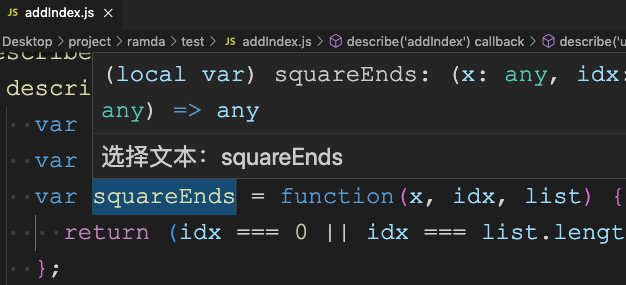

# WordTranslate README

A vocabulary and sentence translation plugin that automatically displays the translation results after the user selects the text.

## Features

Detect JavaScript files, user selects English, automatically translates to Chinese.



## Requirements

Requesting translation API requires the use of MD5 module.

```
npm install md5
```

## Following extension guidelines

Ensure that you've read through the extensions guidelines and follow the best practices for creating your extension.

* [Extension Guidelines](https://code.visualstudio.com/api/references/extension-guidelines)


